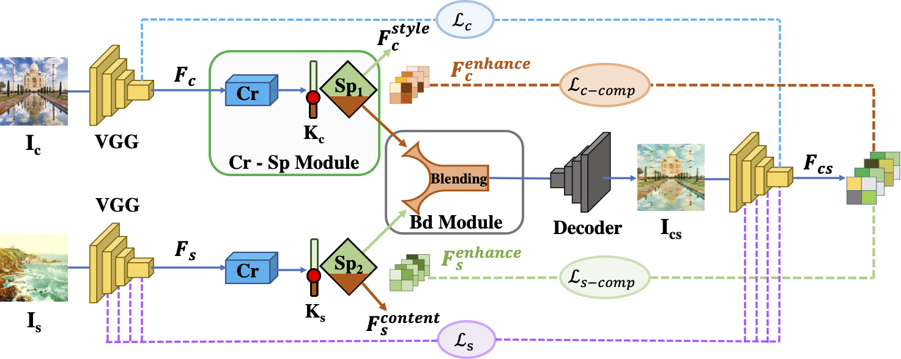

# Universal Video Style Transfer via Crystallization, Separation, and Blending (CSBNet)
This is the official PyTorch implementation for **Universal Video Style Transfer via Crystallization, Separation, and Blending**

## Abstract
Universal video style transfer aims to migrate arbitrary styles to input videos. However, how to maintain the temporal consistency of videos while achieving high-quality arbitrary style transfer is still a hard nut to crack. To resolve this dilemma, in this paper, we propose the CSBNet which involves three key modules: 1) the Crystallization (Cr) Module that generates several orthogonal crystal nuclei, representing hierarchical stability-aware content and style components, from raw VGG features; 2) the Separation (Sp) Module that separates these crystal nuclei to generate the stability-enhanced content and style features; 3) the Blending (Bd) Module to cross-blend these stability-enhanced content and style features, producing more stable and higher-quality stylized videos. Moreover, we also introduce a new pair of component enhancement losses to improve network performance. Extensive qualitative and quantitative experiments are conducted to demonstrate the effectiveness and superiority of our CSBNet. Compared with the state-of-the-art models, it not only produces temporally more consistent and stable results for arbitrary videos but also achieves higher-quality stylizations for arbitrary images.

[Paper](https://web.archive.org/web/20220720142321id_/https://www.ijcai.org/proceedings/2022/0687.pdf)

## Framework



## Preparation 
### Requirements
* Python >=3.6.

* PyTorch >=1.7

* torchvision

* opencv-python

* imageio-ffmpeg

* scipy

* numpy

### Download the Pretrained Models
* Download the pretrained encoder: VGGNet [Google-Drive](https://drive.google.com/file/d/1tFbow4NL6KuO4-DGLK3dhu3uowpAces-/view?usp=sharing)

* (Optional) Download the pretrained model: CSBNet (KC=4, KS=-10) [Google-Drive](https://drive.google.com/file/d/1xQLiBL2MMffFun7x9a2aaHJ0cj4hJgb0/view?usp=sharing)

You can put these two files in the folder "models". An example directory hierarchy is:
```sh
CSBNet
|--- models
      |--- {The pretrained model <VGGNet>.pth}
      |--- {The pretrained model <CSBNet>.pth}
      
 ```
## Testing
### Image Test
Prepare two folders for content images (N) and style images (M). You'll get N*M stylized images.
```sh
python test_image.py \
--content_dir <The path to a single image or a directory> \
--style_dir <The path to a single image or a directory> \
--KC 4 --KS -10 \
--output_dir <The path of the output directory> \
--vgg_path <The path of the pretained vgg-net model> \
--csbnet_path <The path of the csbnet pretrained model> \
```
You can also use the default configration by using the command below:
```sh
python test_image.py \
--content_dir <The path to a single image or a directory> \
--style_dir <The path to a single image or a directory> \
```

### Video Test
```sh
python test_video.py \
--content_dir <The path to a single video or a directory> \
--style_dir <The path to a single image or a directory> \
--KC 4 --KS -10 \
--output_dir <The path of the output directory> \
--vgg_path <The path of the pretained vgg-net model> \
--csbnet_path <The path of the csbnet pretrained model> \
```
Similarly, you can also use the default configration by using the command below:
```sh
python test_video.py \
--content_dir <The path to a single video or a directory> \
--style_dir <The path to a single image or a directory> \
```

## Training
```sh
python train.py \
--content_dir <The path to the content dataset> \
--style_dir <The path to the style dataset> \
```
There are other options for custom training, the meanings of these options are as follows:
```sh
--KC <The value of KC>
--KS <The value of KS>
--lambda_<XXX> <Loss weight>
--vgg_path <The path of the pretrained vggnet>
--lr <Learning rate>
--lr_decay <Learning rate decay>
--max_iter <The number of iteration>
--batch_size <The batch size>
--gpu_num <We provided muilt-gpu training, you only need to specify the number of gpu numbers used for training>
```
For example, if you want to train on four GPUs (ids=0,1,3,5), and **the sum of batch-sizes are 8** you can use the command below: 
```sh
CUDA_VISIBLE_DEVICES=0,1,3,5 python train.py \
--gpu_num 4 \
--batch_size 8 \
--content_dir <The path to the content dataset> \
--style_dir <The path to the style dataset> \
--<other training options>
```

## Citation
```sh
@article{luuniversal,
  title={Universal Video Style Transfer via Crystallization, Separation, and Blending},
  author={Lu, Haofei and Wang, Zhizhong}
}
```

## Acknowledgments
The code in this repository is based on [MCCNet](https://github.com/diyiiyiii/MCCNet). Thanks for both their paper and code.
